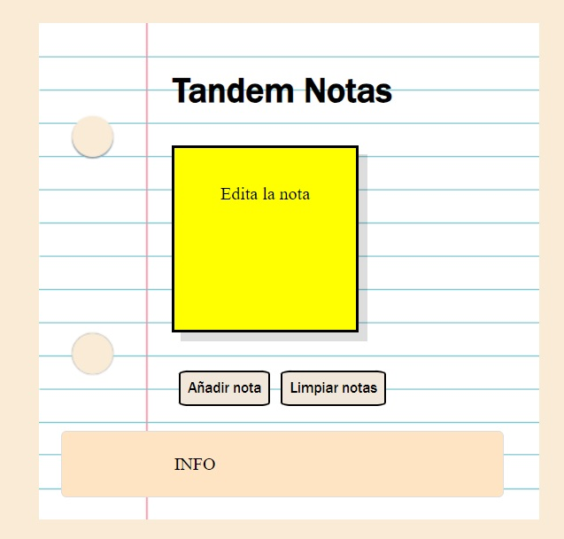

# TandemNotas
- Versión: 0.1
- Autor: **Cristina**
- Licencia: MIT





## Descripción general:
Esta aplicación tiene como intención administrar notas en un equipo cliente y consultarlas más tarde.


## Instalación
Descarga el zip de la siguiente url: 
[https://github.com/Crisbm9/tandemnotas.git](https://github.com/Crisbm9/tandemnotas.git)
o en el shell haz un git clone.
```shell
git clone https://github.com/Crisbm9/tandemnotas.git
```
una vez descargado incluyalo en un repositorio y ejecutalo a través de un navegador.
```
http://localhost:3000/tandemnotas
```

## Tecnologías utilizadas.
**html, css y js**


## Instrucciones de uso
1. Escribe tu nota dentro del post-it
2. Pulsa el botón de añadir nota y se guardará para consultarla después (aparecerá debajo)
3. Podrás borrar las notas guardadas con el botón de limpiar notas.

## Solución de problemas:
- Si no hay una nota disponible aparecerá un mensaje "no hay notas disponible"
- El botón está deshabilitado si no se edita la nota
- Se eliminarán las notas individuales en una futura version

## Información de contacto:
Puedes contactar con nostros, o proponer tu contribución a través de nuestro correo:
[cristinab.tandem@gmail.com](mailto:cristinab.tandem@gmail.com)

[Teléfono: 66666666](tel:+34666666666)

### Reconocimientos:
>Agradecimientos a MDN por sus tutoriales.


### Apéndices:
Más información en nuestro github:
[Crisbm9](https://Crisbm9.github.io)

## Versiones
|Versión|Fecha|Cambios|
|--|--|--|
|0.1|17/04/24|funcionalidad básica|